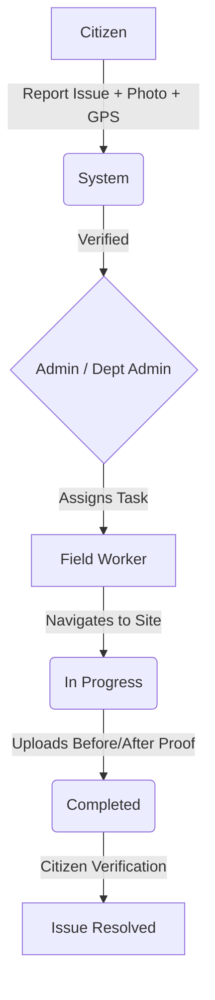

# CivicConnect

## Project Overview
CivicConnect is a smart, role-based civic issue management platform designed to streamline the reporting and resolution of public infrastructure problems. Citizens can report issues with photos and GPS locations, while municipal authorities can verify, assign, and track the progress of these complaints. The system empowers field workers to update task statuses and provide before-and-after photographic evidence, culminating in a transparent, citizen-verified resolution process.

## Problem We Solve
Reporting public infrastructure issues (like potholes, broken streetlights, or waste accumulation) is often a fragmented and opaque process. Citizens struggle to report problems accurately, authorities face challenges in managing and assigning these issues, and there is often a lack of accountability and feedback when tasks are completed.

## Solution
CivicConnect provides a unified, map-based platform where issues are reported accurately, routed efficiently to the correct departments, and tracked transparently from report to resolution.

## Key Features
- **Location-Aware Reporting:** Report issues directly on an interactive map.
- **Role-Based Workflows:** Distinct dashboards and toolsets for Citizens, Super Admins, Department Admins, and Field Workers.
- **Evidence-Based Resolution:** Mandatory before-and-after photos by field workers.
- **Analytics & Heatmaps:** Data-driven administration and visual representation of problem areas.

## User Roles
1. **Citizen:** Reports civic issues, tracks complaint status, and views nearby problems.
2. **Super Admin:** Views overall system analytics, manages users, departments, workers, and system-level escalations.
3. **Department Admin:** Manages department-specific issues and assigns tasks to field workers.
4. **Field Worker:** Receives assigned tasks, updates statuses, and uploads proof of resolution.
5. **Ward Officer:** Dedicated views for ward-level analytics, issues, and mapping (Components implemented; pending full routing integration).

## System Workflow


## Frontend Architecture

### Folder Structure
```
civic-connect/
│
├── public/                # Static assets
├── src/
│   ├── assets/            # Global styles and media
│   ├── components/        # Reusable UI components
│   ├── config/            # Configuration files
│   ├── context/           # Global React state (Auth, Civic, Toast, Worker)
│   ├── data/              # Mock data for frontend development
│   ├── hooks/             # Custom React hooks
│   ├── layouts/           # Role-based layouts (Admin, Citizen, Dept, Worker)
│   ├── pages/             # Page-level components grouped by role
│   ├── routes/            # Application routing definitions
│   ├── services/          # API service modules
│   ├── utils/             # Helper functions
│   ├── App.jsx            # Main app component & router
│   ├── index.css          # Tailwind & global CSS entry
│   └── main.jsx           # React entry point
│
├── .gitignore
├── .oxlintrc.json
├── package.json           # Dependencies & scripts
├── vite.config.js         # Vite configuration
└── README.md
```

### Role-Based Architecture
The application separates concerns by grouping pages based on user roles inside `src/pages/`:
- `citizen/`: Citizen-focused reporting, nearby maps, and tracking tools.
- `admin/`: System-wide management, global analytics, and oversight tools.
- `department/`: Department-level issue management and worker assignment.
- `worker/`: Field-worker task management and proof upload interfaces.
- `officer/`: Ward officer dashboards (UI developed, routing planned).
- `auth/` & `public/`: Authentication, layout wrappers, and public landing pages.

### Routing
The application uses React Router with protected role-based routes.

| Route | Role | Purpose |
|------|------|---------|
| `/` or `/landing` | Public | Landing page |
| `/login` | Public | User login |
| `/unauthorized` | Public | Access denied page |
| `/admin/*` | Super Admin | Admin dashboard, users, issues, analytics, heatmap, settings |
| `/department/*` | Dept Admin | Department dashboard, issues, workers, assign |
| `/worker/*` | Field Worker | Worker tasks, map, notifications, proof upload |
| `/citizen/*` | Citizen | Citizen dashboard, report issue, my reports, nearby map |

*Note: All role-specific routes are wrapped in a `<ProtectedRoute />` component that enforces role-based access.*

### Component Architecture
The project emphasizes reusability with a rich set of shared components in `src/components/`:

- **Common Components:** `Navbar`, `Sidebar`, `Button`, `Modal`, `Toast`, `CommandPalette`, `ProtectedRoute`, `RoleSwitcher`, `Select`, `Input`, `Pagination`.
- **Map Components:** `IssueMap`, `IssueMarker`, `LocationPicker`, `MapFilters`, `HeatMap`.
- **Issue Components:** `IssueCard`, `IssueDetails`, `IssueTable`, `IssueTimeline`, `IssueStatus`, `IssuePriority`, `AssignWorkerModal`.
- **Worker Components:** `TaskCard`, `BeforeAfterUpload`, `SLAIndicator`, `LocationCard`, `ResolutionVerification`, `AIAnalysisCard`.

## Citizen Module
- **Dashboard:** Overview of personal reports.
- **Report Issue:** Form to submit new issues with image uploading and location picking.
- **My Reports:** List and tracking of submitted issues.
- **Nearby Map:** Interactive map displaying localized civic issues.

## Admin Module
- **Dashboard:** High-level metrics.
- **Issues & Details:** Comprehensive issue verification and management.
- **User/Department/Worker Management:** Administrative control over platform entities.
- **Analytics & Heatmap:** Data visualization of civic issues.
- **Escalations:** View issues that have missed their SLA targets.

## Department Module
- **Dashboard:** Department-specific metrics.
- **Assign Worker:** Interface to assign verified issues to field workers.
- **Workers:** Tracking department field worker statuses.
- **Issues:** Department-filtered issue management.

## Field Worker Module
A critical component of CivicConnect is the Field Worker module. Workers use this interface to:
1. View **Assigned Tasks** on a map or list.
2. Accept and start work (transitioning the issue).
3. Provide **Before/After Evidence** using the `BeforeAfterUpload` component.
4. Mark tasks as completed, awaiting citizen verification.
- **Includes:** Worker Dashboard, Assigned Tasks, Task Details, Worker Map, Notifications, and Profile.

## Map & Location
The project heavily utilizes mapping capabilities:
- **Leaflet & React-Leaflet** implementation for robust mapping.
- **Location Picker** for precise issue reporting.
- **Issue Markers** to visualize complaints geographically.
- **Heatmap** to identify critical problem areas.

## Issue Management
- Complete status lifecycle tracking.
- Visual **Priority Badges** (Low, Medium, High, Critical).
- Detailed **Issue Timeline** showing progression from report to resolution.
- Dynamic **Issue Cards** and **Tables** for easy scanning.

## Mock Data
Currently, the frontend is decoupled from a live backend to facilitate rapid UI/UX development. Mock data is extensively used and stored in `src/data/` (e.g., `mockIssues.js`, `mockUsers.js`, `workerMockData.js`, `mockAnalytics.js`) to simulate API responses and populate the UI.

## Technology Stack

| Technology | Purpose |
|------------|---------|
| **React (v19)** | Frontend UI library |
| **Vite** | Fast development server & build tool |
| **Tailwind CSS** | Utility-first styling |
| **React Router DOM** | Client-side routing |
| **Leaflet / React-Leaflet**| Interactive maps |
| **Recharts** | Analytics and data visualization |
| **Lucide React** | Iconography |
| **Firebase** | Authentication integration (Included as dependency) |
| **Oxlint** | Fast code linting |
| **Context API** | Global state management |

## Installation

1. **Clone the repository:**
   ```bash
   git clone <repository-url>
   ```
2. **Navigate to the frontend folder:**
   ```bash
   cd civic-connect
   ```
3. **Install dependencies:**
   ```bash
   npm install
   ```
4. **Start the development server:**
   ```bash
   npm run dev
   ```

*Other available scripts:*
- `npm run build` (Build for production)
- `npm run preview` (Preview production build)
- `npm run lint` (Run Oxlint for code quality)

## Environment Variables
The frontend may require environment variables for maps or API endpoints in the future.
*(Currently, no `.env` file is explicitly required to run the mock-data driven UI).*

## Development Workflow & Git Branch Strategy
For this hackathon project, we recommend the following branch structure:
- `main`: Stable production-ready code.
- `develop`: Integration branch for all completed features.
- `feature/role-name`: e.g., `feature/citizen`, `feature/admin` for role-specific development.
- `feature/common-ui`: For shared components.

*Features should be developed on separate branches and merged via Pull Requests.*

## Current Development Status
### Completed
- Project scaffold and Vite setup.
- Role-based routing, Context API state management, and protected layouts.
- Comprehensive UI component library (Tailwind + custom React components).
- Citizen issue reporting form and interactive map (`react-leaflet`).
- Admin and Department dashboards with mock analytics and heatmaps.
- Field worker task management and before/after proof upload interfaces.
- Mock data integration for all modules.

### In Progress
- Complete integration of Ward Officer routes.
- Firebase Authentication wiring.

### Planned
- **Backend Integration:** Connecting the frontend to a live Node.js + MongoDB backend.
- **Live APIs:** Full backend routing and data persistence.
- **AI Features:** See below.
- **Cloud Image Storage:** Integration with a service like Cloudinary.

## Planned Backend Integration
The intended architecture is a React frontend communicating with a REST API built on Node.js and Express, backed by a MongoDB database. Features like image uploads will utilize Cloudinary, and real-time notifications are planned using Socket.IO.

## Planned AI Features
Future iterations of CivicConnect aim to include advanced AI capabilities:
1. **Image Classification:** Automatically detect issues like potholes or garbage.
2. **Severity Detection:** Estimate issue severity from uploaded images.
3. **Duplicate Detection:** Flag visually and geographically similar reports to prevent redundancy.
4. **Automatic Department Routing:** Suggest the correct department based on the report.

## Security Considerations
- **Protected Routes:** The frontend enforces role-based access control via the `ProtectedRoute` component.
- **Important:** Frontend route protection is not a replacement for backend authorization. The future backend must independently validate authentication and permissions.

## Accessibility
The design system incorporates accessibility practices including:
- Semantic HTML and functional contrast.
- Legible typography and recognizable icons (Lucide).
- Clear, descriptive empty states and loading skeletons.

## Contributing
1. Create a branch: `git checkout -b feature/your-feature`
2. Make your changes and test locally.
3. Commit your changes: `git commit -m "Add your feature"`
4. Push to the branch: `git push origin feature/your-feature`
5. Create a Pull Request for review.

## Troubleshooting
- **`npm install` fails:** Ensure you are using a compatible Node.js version (v18+ recommended) and try clearing the npm cache.
- **Port already in use:** Vite defaults to port 5173. If it's taken, Vite will automatically try the next available port, or you can specify one in `vite.config.js`.

## Future Improvements
- Migration from mock data to live REST APIs.
- Real-time SLA monitoring and automatic escalations.
- Citizen verification loop completion.

## License
License: Not specified yet.

## Acknowledgments
- Map tiles provided by OpenStreetMap.
- Icons provided by Lucide React.
- Built with React, Vite, and Tailwind CSS.
